# Custom Packly OS: all tables and their relationships

Design reference · 19 September 2026 · Based on the existing logical data model

**Use one PostgreSQL database and one application schema.** In this discussion, “schemas” means the definitions of tables such as `invoices` and `payments`. Each table has a Drizzle definition; related definitions can share a TypeScript module. Authentication-provider internal tables are managed separately and are not included in this count.

**The detailed plan contains 57 defined tables: 53 for the complete basic business scope and four later additions.** This is a count of this design, not a universal minimum. You still have six main user journeys. Supporting tables do not each need a screen.

| Build stage | New tables | Total at this stage |
| --- | ---: | ---: |
| F — Foundation | 18 | 18 |
| I — Invoice → payment → job pilot | 12 | 30 |
| O — Production, shipping, vendors and costs | 11 | 41 |
| B — Complete basic scope: partners, close and reports | 12 | 53 |
| L — Later automation | 4 | 57 |

Start with F + I. Add foreign keys and fields pointing at a later-stage table when that stage is built. For example, the pilot payment command needs customer fields before it needs partner and vendor fields. The full financial reports become available after their supporting costs, opening balances and recognition records are implemented.

## How to read the diagrams

Each box is a table. `PK` identifies a row, `FK` points to another table, and `UK` is a unique key. `||` means exactly one, `o|` means zero or one, and `o{` means zero or many. Read the cardinality at each end. Repeated table names in different diagrams refer to the same table, not copies.

The 14 panels cover every defined table. They show selected columns and relationships to remain readable; the complete field register and explicit foreign-key register follow them. Common entity ownership, currency links and actor fields are not drawn repeatedly. Zero-line drafts are allowed where relevant; issuing/posting imposes the stronger requirements described in the rules.

All diagrams are embedded below as Mermaid. A Mermaid-enabled Markdown viewer can show them together. Individual editable sources are in `diagrams/`; paste one `.mmd` file into Mermaid Live Editor when needed.

## Table inventory

| Area | Count | Tables |
| --- | ---: | --- |
| Business, markets and access | 6 | `currencies` (F), `legal_entities` (F), `markets` (F), `entity_markets` (F), `app_users` (F), `entity_memberships` (F) |
| Bookkeeping configuration | 5 | `document_sequences` (F), `accounting_periods` (F), `accounting_policies` (F), `gl_accounts` (F), `tax_codes` (F) |
| Customers and invoicing | 6 | `customers` (I), `invoices` (I), `invoice_lines` (I), `payment_links` (I), `customer_credit_notes` (I), `customer_credit_lines` (I) |
| Payments and cash controls | 8 | `money_accounts` (F), `payments` (I), `customer_payment_allocations` (I), `vendor_payment_allocations` (O), `account_transfers` (B), `payment_disputes` (B), `reconciliation_sessions` (B), `reconciliation_items` (B) |
| Jobs, production and shipping | 6 | `jobs` (I), `job_items` (I), `production_runs` (O), `production_run_items` (O), `shipments` (O), `shipment_items` (O) |
| Vendors, bills and expected costs | 5 | `vendors` (O), `vendor_roles` (O), `vendor_bills` (O), `vendor_bill_lines` (O), `job_cost_estimates` (O) |
| Ledger and recognition | 5 | `journal_entries` (F), `journal_lines` (F), `accounting_adjustments` (B), `recognition_events` (B), `recognition_lines` (B) |
| Partner accounts | 5 | `partners` (B), `partner_accounts` (B), `partner_events` (B), `profit_distributions` (B), `profit_distribution_lines` (B) |
| Documents and reliability | 7 | `files` (F), `generated_documents` (I), `document_deliveries` (I), `job_file_links` (O), `audit_events` (F), `idempotency_requests` (F), `outbox_tasks` (F) |
| Later automation | 4 | `recurring_expense_templates` (L), `profit_policies` (L), `profit_policy_shares` (L), `webhook_events` (L) |

## Relationship diagrams

### 1. Business, markets and access

A legal entity owns a set of books. US, UK and AU are markets, not automatically separate companies. Global is a filter. Memberships connect logins to the business books they may access. Currency is a lookup used throughout the model.

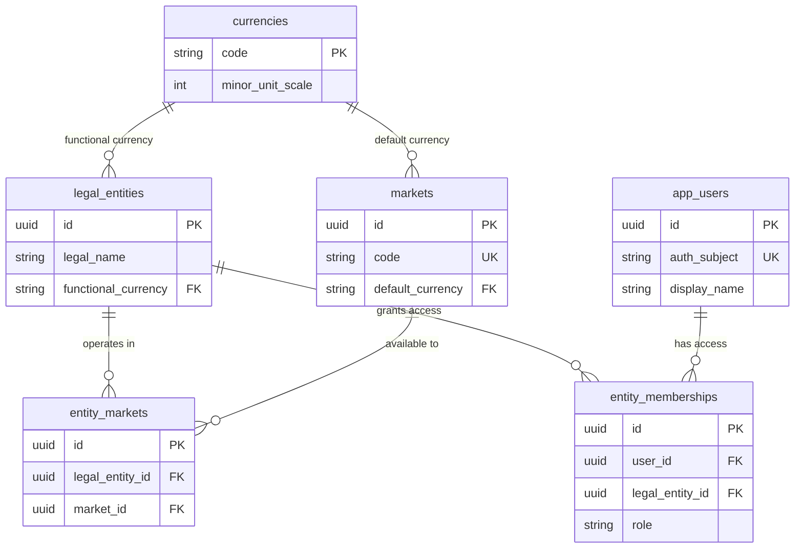

### 2. Bookkeeping configuration

These are background configuration tables. Document sequences number invoices, jobs and receipts. Periods control closing dates; policy versions preserve the rules used by historical postings. GL accounts classify assets, liabilities, equity, income and expenses.

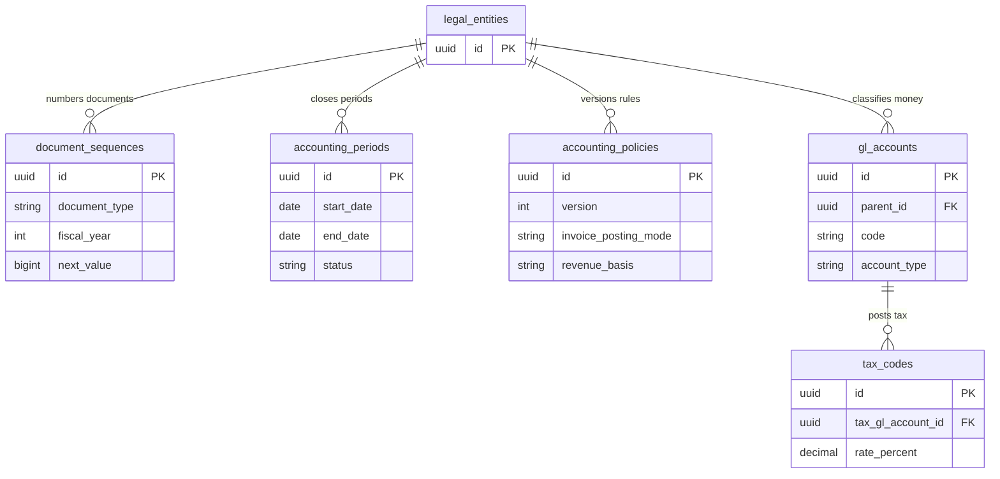

### 3. Customers, invoices and corrections

An invoice contains line items and can have replacement payment links. A credit note corrects an issued charge; its lines point back to the original invoice lines. A payment link does not prove that payment was received. Issued documents require at least one valid line.

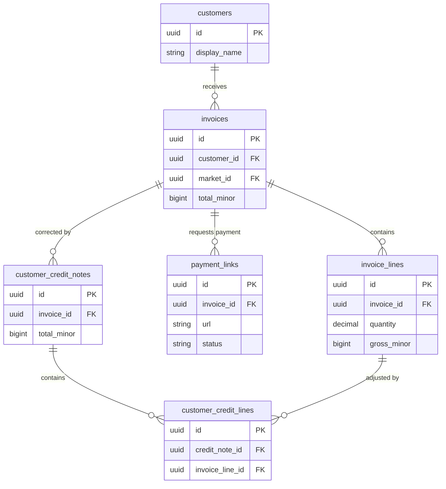

### 4. One payment system linking both sides

The same payments table records incoming and outgoing money. An allocation says how much of a payment settles one invoice or bill. This supports partial payments, several receipts against one invoice and one payment covering several bills. A positively funded, eligible invoice creates at most one job; an unpaid invoice creates none. jobs.origin_invoice_id is unique.

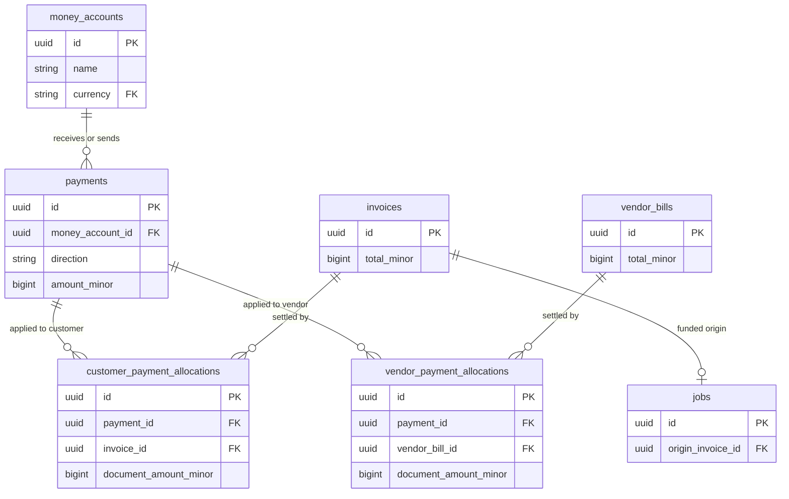

### 5. Jobs and production

Jobs is the single order table. Production lives inside the job screen but has its own records. Each run belongs to one job and one vendor. Run items connect the run to particular ordered items and their quantities. Job items also retain their originating invoice-line IDs.

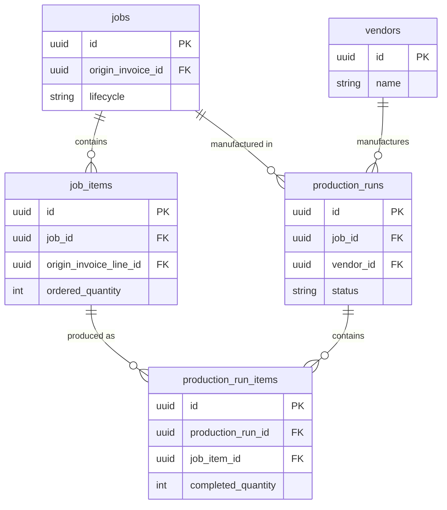

### 6. Shipping and vendor roles

One job may ship in several consignments. Shipment items record which ordered items and quantities were shipped and delivered. A vendor can have production, shipping and other roles, so separate vendor tables are unnecessary.

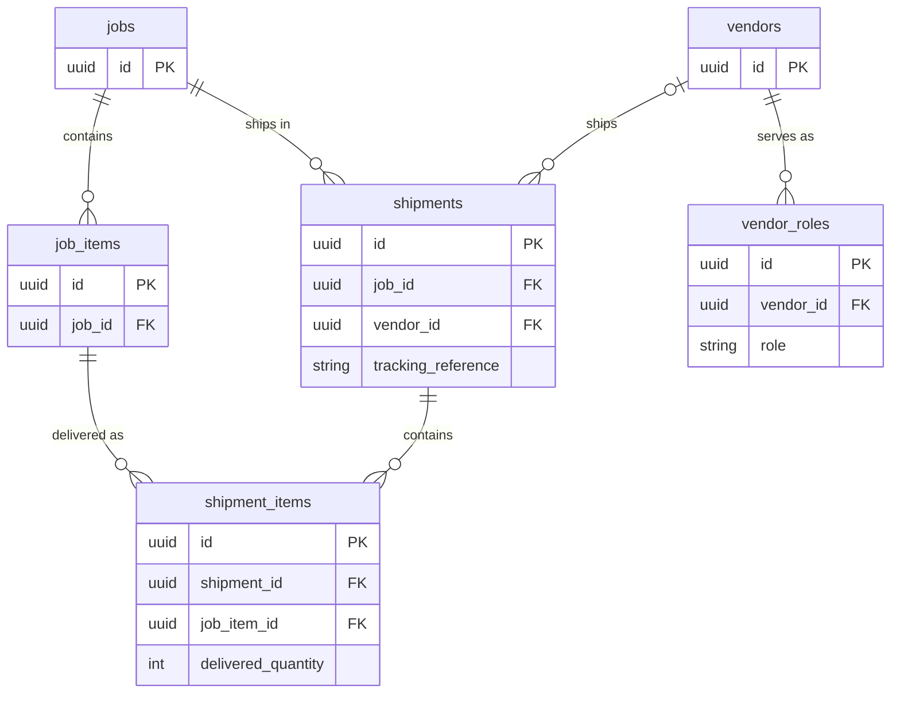

### 7. Expected costs, vendor bills and expenses

Job cost estimates are forecasts. Vendor bills record actual supplier charges. Bill lines optionally point to a job, production run, shipment and estimate. An overhead line has no job and uses its expense GL account. One bill can cover several jobs through separate lines. Paying it does not add the cost again.

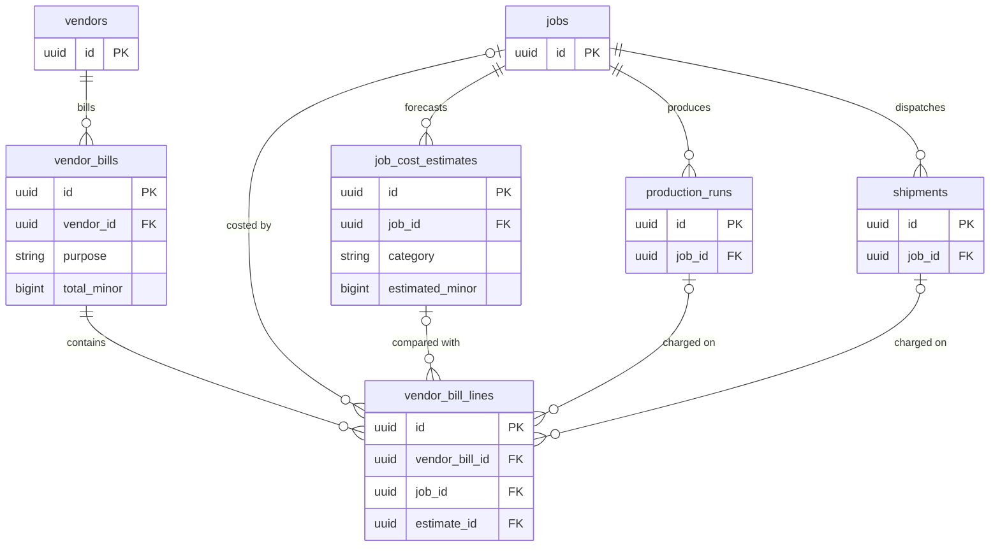

### 8. Financial records behind balances and reports

Financial actions create balanced journals automatically. A posted payment references its journal and its exact cash line. Money-account balances come from ledger lines. Adjustments record documented opening balances, accruals and corrections. A posted journal needs at least two lines and equal debits and credits. No separate stored balance or profit table is needed.

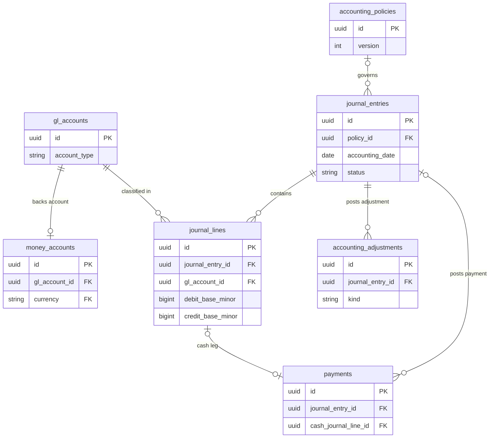

### 9. Transfers, payment disputes and account checks

A transfer has a source and destination account and two payment legs. Transfer principal is neither sales nor expense. A dispute is a case record; an actual debit or recovery is a separate linked payment. Reconciliation matches statement evidence to existing cash journal lines without creating duplicate payments.

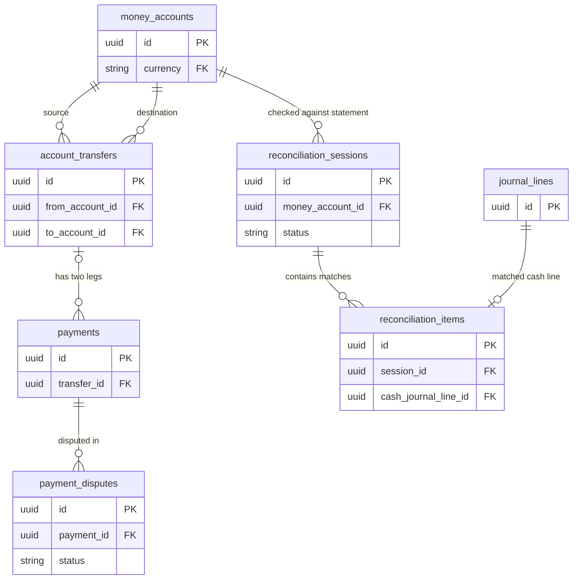

### 10. Job progress and recognised profit

Recognition records connect earned revenue and released costs to the relevant job items and financial journal under the chosen policy. A customer receipt alone does not decide when revenue is earned. Forecast margin, recognised profit and cash flow are different views.

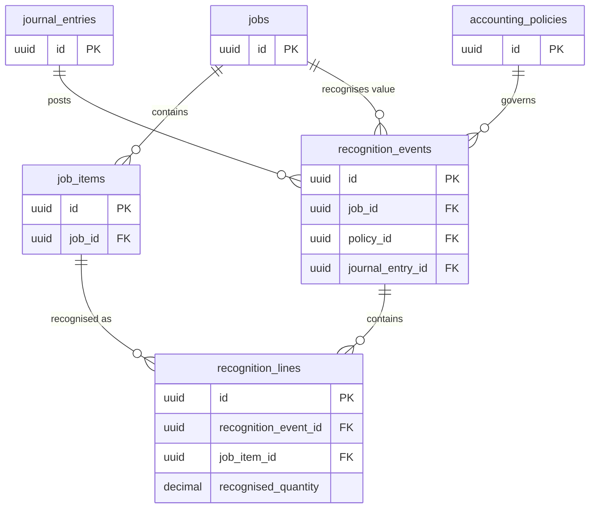

### 11. Partner allocations and cash movements

Partner accounts separate capital, loans and distributable balances. A profit distribution allocates an approved amount from a closed period; its lines give each partner their amount. This creates no payment. A contribution or withdrawal uses the shared payments table and a partner event. No 50/50 ownership assumption is built in.

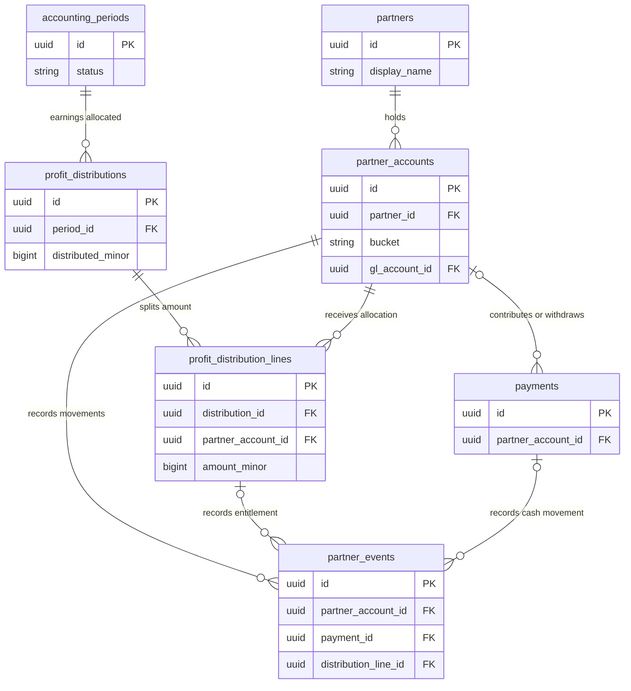

### 12. PDFs, receipts, artwork and delivery evidence

A generated document has exactly one subject: invoice, credit note or payment receipt. Its file can be absent while generation is pending. Sending attempts are separate from document generation. Job attachments reuse the files table. Actual file bytes live in private object storage; these tables store metadata and links.

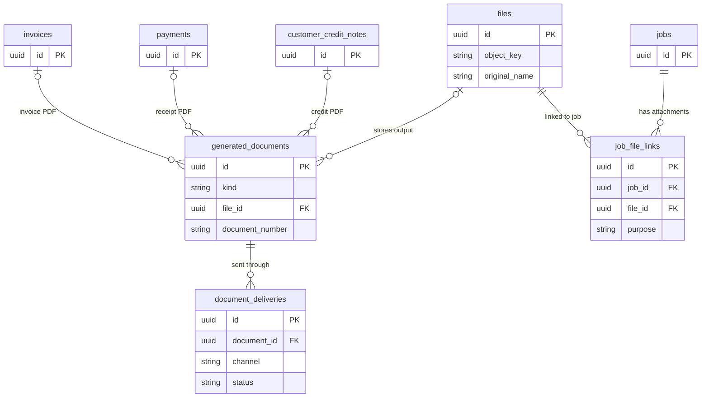

### 13. Audit and reliable commands

These tables run in the background. Audit records who changed something; idempotency prevents a repeated click or retry from posting twice; outbox tasks retry PDF generation and other follow-up work after the business transaction commits. Audit subjects and task payload references are application metadata, not invented financial foreign keys.

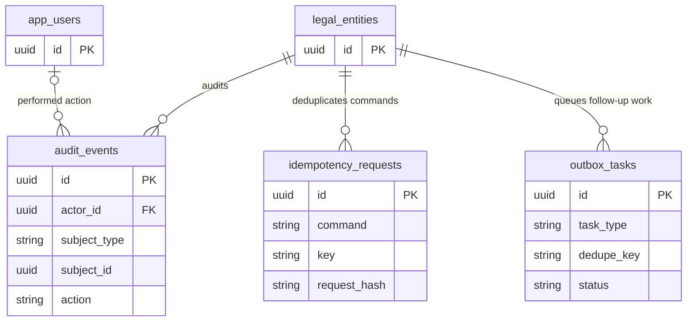

### 14. Four later additions

These four new tables are outside the 53-table complete basic release: recurring_expense_templates, profit_policies, profit_policy_shares and webhook_events. Templates create draft bills, not payments. Policy shares automate future allocation rules. A webhook event is an incoming provider message; it must be verified and processed through the same existing payment command.

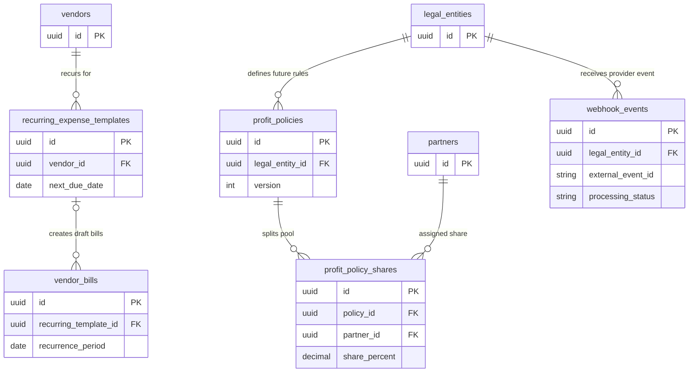

## What stays separate and what shares a screen

| Screen or action | Separate underlying records |
| --- | --- |
| Invoice → Record payment | Payment, invoice allocation, journal, generated receipt and eligible job |
| Job → Production | Production runs, run items and cost estimates |
| Job → Shipping | Shipments, shipment items and shipping cost records |
| Costs → Paid now | Vendor bill, bill lines, payment and vendor allocation |
| Partners → Withdraw | Payment and partner event sharing one journal |
| Partners → Allocate profit | Distribution, distribution lines and partner events; no cash payment |
| Reports and balances | Queries over existing invoices, bills, jobs, allocations and journal lines |

Use one `jobs` table for orders. Production and shipping vendors share `vendors` plus `vendor_roles`. Expenses are overhead vendor-bill lines; the recurring template is optional later. Receipts are generated documents linked to payments. Dashboards, global/market views, P&L, account balances and vendor ledgers are queries/views, not additional independent records of money.

## Rules that the diagram alone cannot enforce

1. A verified payment, allocations, financial posting and any newly eligible job commit together. Retries must return the existing result. `jobs.origin_invoice_id` is unique.
2. No verified funds means no automatic job. Partial receipts remain recorded without triggering production. Credit notes or write-offs do not count as real funding. Refunds and reversals retain job history and recalculate funding.
3. A payment records money moving. An allocation records how that money settles a charge. A bill records an amount owed. Their values cannot be counted twice.
4. Allocations cannot exceed the remaining usable payment or eligible invoice/bill balance. Currency conversions preserve both amounts and the exchange-rate snapshot.
5. Every linked financial record belongs to the permitted legal entity. Enforce composite entity foreign keys where needed. A market filter is not an access-control boundary.
6. Every posted journal balances. Posted financial history is corrected through linked reversals or adjustment records, not deletion or overwriting.
7. Invoice parties, amounts, taxes and specifications are frozen on issue. Job items retain their originating invoice lines. Production and shipment items must belong to the same job as their parent run/shipment.
8. Profit allocation and cash withdrawal are separate actions. Both can affect a partner account, but only the withdrawal moves business cash.
9. Invoice and bill payment status is derived from posted allocations and corrections. Account balances and reported profit come from financial postings.
10. Store money as integer minor units and use exact decimal calculations for rates and intermediate prices. Do not add different currencies without an explicit reporting conversion.

## Full logical field register

This is a planning contract, not executable SQL. Ordinary tables have `id uuid PK`, `created_at timestamptz` and an appropriate actor reference such as `created_by → app_users`. The currency lookup uses `code` as its primary key. Mutable draft/configuration records also have `updated_at` and an optimistic-lock `version` where applicable. These shared columns are omitted below. `ID` means UUID foreign key, `?` means nullable, `ccy` references `currencies.code`, `money` means bigint minor units, `rate` means numeric(24,12), `qty` means numeric(18,3), `json` means jsonb, and `time` means timestamptz. Physical quantities are whole units initially.

Common ownership columns required for composite entity scoping must be added to the relevant child tables during implementation. A diagram line does not replace the aggregate checks, constraints and transactional locks described in the source model.

### Business, markets and access

| Table | Stage | Important columns | Rules |
| --- | --- | --- | --- |
| `currencies` | F | `code char(3) PK`, `minor_unit_scale int`, `name text` | ISO codes; scale validated; no surrogate UUID required |
| `legal_entities` | F | `legal_name text`, `registered_address json`, `registration_ref text?`, `tax_registration_refs json`, `functional_currency ccy`, `timezone text`, `fiscal_year_start_month int`, `active bool` | One set of books per entity; functional-currency change is a migration/policy event, not an ordinary settings edit |
| `markets` | F | `code text UQ`, `name text`, `default_currency ccy` | Seed US, UK, AU; no Global row |
| `entity_markets` | F | `legal_entity_id ID → legal_entities`, `market_id ID → markets`, `active bool` | UQ entity + market; invoice combination must exist |
| `app_users` | F | `auth_subject text UQ`, `display_name text`, `email text`, `active bool` | Provider-managed identities map here; no app-owned password table |
| `entity_memberships` | F | `user_id ID → app_users`, `legal_entity_id ID → legal_entities`, `role text`, `active bool` | UQ user + entity; start with explicit access for Momin and Zohaib |

### Bookkeeping configuration

| Table | Stage | Important columns | Rules |
| --- | --- | --- | --- |
| `document_sequences` | F | `legal_entity_id ID`, `document_type text`, `fiscal_year int`, `prefix text`, `next_value bigint` | UQ entity + type + fiscal year; allocate under lock, never `MAX(number)+1` |
| `accounting_periods` | F | `legal_entity_id ID`, `start_date date`, `end_date date`, `status text`, `closed_at time?`, `closed_by ID?` | Date intervals do not overlap per entity; reject postings to a closed period |
| `accounting_policies` | F | `legal_entity_id ID`, `version int`, `effective_from date`, `effective_to date?`, `invoice_posting_mode text`, `revenue_basis text`, `tax_timing_rules json`, `cost_rules json`, `approved_by ID?`, `approved_at time?` | Policies are versioned and referenced by posted documents; no silent retrospective change |
| `gl_accounts` | F | `legal_entity_id ID`, `code text`, `name text`, `account_type text`, `subtype text`, `parent_id ID → gl_accounts?`, `is_control bool`, `active bool` | UQ entity + code; types asset, liability, equity, income, expense; control accounts restrict manual postings |
| `tax_codes` | F | `legal_entity_id ID`, `code text`, `name text`, `jurisdiction text?`, `rate_percent numeric(9,6)`, `direction text`, `tax_gl_account_id ID`, `recoverable_percent numeric(9,6)`, `effective_from date`, `effective_to date?` | Effective-dated; no hardcoded country tax percentage; distinguish zero-rated, exempt and out-of-scope where applicable |

### Customers and invoicing

| Table | Stage | Important columns | Rules |
| --- | --- | --- | --- |
| `customers` | I | `legal_entity_id ID`, `display_name text`, `company_name text?`, `email text?`, `phone text?`, `billing_address json`, `default_delivery_address json?`, `tax_ref text?`, `default_currency ccy?`, `active bool`, `notes text?` | Scope to entity in v1; customer identity can later be shared through a separate group record |
| `invoices` | I | `legal_entity_id ID`, `market_id ID`, `customer_id ID`, `number text?`, `document_kind text`, `status text`, `issue_date date?`, `due_date date?`, `currency ccy`, `seller_snapshot json`, `customer_snapshot json`, `billing_snapshot json`, `delivery_snapshot json`, `terms_snapshot json`, `subtotal_minor money`, `discount_minor money`, `tax_minor money`, `total_minor money`, `policy_id ID`, `issue_journal_entry_id ID?`, `void_journal_entry_id ID?`, `issued_at time?`, `last_sent_at time?` | Kind invoice/proforma; status draft/issued/voided; UQ entity + final number; frozen financial content after issue |
| `invoice_lines` | I | `invoice_id ID`, `position int`, `kind text`, `description text`, `quantity qty`, `unit_price_major numeric(24,8)`, `discount_minor money`, `net_minor money`, `tax_code_id ID?`, `tax_snapshot json`, `tax_minor money`, `gross_minor money`, `fulfilment_required bool`, `specification_snapshot json` | UQ invoice + position; positive physical quantities; service/charge lines do not automatically create manufactured job items |
| `payment_links` | I | `invoice_id ID`, `provider text`, `external_reference text?`, `url text`, `currency ccy`, `amount_minor money`, `status text`, `created_for_version int`, `expires_at time?` | Several links can exist over time; HTTPS; audit replacements; status does not establish invoice funding |
| `customer_credit_notes` | I | `legal_entity_id ID`, `invoice_id ID`, `number text?`, `status text`, `credit_date date`, `currency ccy`, `reason text`, `net_minor money`, `tax_minor money`, `total_minor money`, `journal_entry_id ID?`, `approved_by ID?` | Positive credit amounts; same customer/entity/currency as invoice; freeze after issue; aggregate credit cannot exceed eligible original charges |
| `customer_credit_lines` | I | `credit_note_id ID`, `invoice_line_id ID`, `quantity qty?`, `net_minor money`, `tax_minor money`, `gross_minor money`, `tax_snapshot json` | Line-level references keep tax and quantity corrections attributable |

### Payments and cash controls

| Table | Stage | Important columns | Rules |
| --- | --- | --- | --- |
| `money_accounts` | F | `legal_entity_id ID`, `name text`, `kind text`, `currency ccy`, `gl_account_id ID → gl_accounts`, `provider text?`, `masked_reference text?`, `active bool` | UQ entity + GL account; kind bank, processor or cash; each account has one currency and one owner |
| `payments` | I | `legal_entity_id ID`, `money_account_id ID`, `direction text`, `kind text`, `status text`, `amount_minor money`, `currency ccy`, `received_or_paid_at time`, `accounting_date date`, `method text`, `external_provider text?`, `external_id text?`, `reference text?`, `customer_id ID?`, `vendor_id ID?`, `partner_account_id ID?`, `transfer_id ID?`, `original_payment_id ID?`, `reversal_of_id ID?`, `journal_entry_id ID?`, `cash_journal_line_id ID?`, `evidence_file_id ID?`, `verified_by ID?` | Amount > 0; currency equals money account currency; posted record requires journal/cash line; UQ money account + provider + external_id when present; UQ reversal_of_id |
| `customer_payment_allocations` | I | `legal_entity_id ID`, `payment_id ID`, `invoice_id ID`, `payment_amount_minor money`, `document_amount_minor money`, `effect int`, `purpose text`, `original_allocation_id ID?`, `journal_entry_id ID`, `allocated_at time` | Positive amount columns; effect +1 settlement / -1 reduction; explicit FX when payment and invoice currencies differ; append-only |
| `vendor_payment_allocations` | O | `legal_entity_id ID`, `payment_id ID`, `vendor_bill_id ID`, `payment_amount_minor money`, `document_amount_minor money`, `effect int`, `purpose text`, `original_allocation_id ID?`, `journal_entry_id ID`, `allocated_at time` | Same allocation/FX rules as customer side; no cross-vendor settlement; cap against both available funds and payable/credit |
| `account_transfers` | B | `legal_entity_id ID`, `from_account_id ID`, `to_account_id ID`, `from_amount_minor money`, `to_amount_minor money`, `effective_at time`, `fx_rate rate?`, `journal_entry_id ID`, `reference text?` | Different accounts; same entity; two linked payment legs; preserve both currencies and amounts; fees are separate |
| `payment_disputes` | B | `payment_id ID`, `provider_case_id text?`, `status text`, `opened_at time`, `resolved_at time?`, `amount_minor money`, `currency ccy`, `outcome text?`, `settlement_payment_id ID?` | A dispute flag alone is not a cash movement; actual debits/recoveries have payment/journal records |
| `reconciliation_sessions` | B | `money_account_id ID`, `from_date date`, `to_date date`, `statement_opening_minor money`, `statement_closing_minor money`, `status text`, `statement_file_id ID?`, `closed_by ID?`, `closed_at time?` | Currency from account; explain differences and reconcile opening before close |
| `reconciliation_items` | B | `session_id ID`, `cash_journal_line_id ID`, `matched_amount_minor money`, `note text?` | Same account; each cash line cleared once in basic manual reconciliation; partial/grouped statement matching is later work |

### Jobs, production and shipping

| Table | Stage | Important columns | Rules |
| --- | --- | --- | --- |
| `jobs` | I | `legal_entity_id ID`, `market_id ID`, `customer_id ID`, `origin_invoice_id ID`, `number text`, `lifecycle text`, `opened_at time`, `requested_delivery_date date?`, `delivery_snapshot json`, `artwork_status text`, `approved_artwork_file_id ID?`, `artwork_approved_by ID?`, `artwork_approved_at time?`, `hold_reason text?`, `financial_close_status text` | UQ origin_invoice_id; UQ entity + number; originating invoice matches customer/entity/market; financial close separate from fulfilment |
| `job_items` | I | `job_id ID`, `origin_invoice_line_id ID`, `description text`, `ordered_quantity int`, `unit text`, `specification_snapshot json`, `artwork_file_id ID?` | Quantity > 0; immutable original agreement, audited amendments; UQ job + origin line in v1 |
| `production_runs` | O | `job_id ID`, `vendor_id ID`, `status text`, `planned_start date?`, `expected_finish date?`, `started_at time?`, `completed_at time?`, `released_specification json`, `released_artwork_file_id ID?`, `notes text?` | Many runs per job; require funding/artwork checks before release; only approved vendor roles |
| `production_run_items` | O | `production_run_id ID`, `job_item_id ID`, `planned_quantity int`, `completed_quantity int`, `rejected_quantity int` | UQ run + job item; all items belong to run's job; aggregate overproduction/rework requires documented treatment |
| `shipments` | O | `job_id ID`, `vendor_id ID?`, `carrier_name text?`, `status text`, `tracking_reference text?`, `tracking_url text?`, `destination_snapshot json`, `planned_dispatch date?`, `dispatched_at time?`, `delivered_at time?`, `exception_reason text?`, `replacement_for_shipment_id ID?` | Many shipments per job; delivered timestamp follows dispatch unless an explained import/correction |
| `shipment_items` | O | `shipment_id ID`, `job_item_id ID`, `shipped_quantity int`, `delivered_quantity int`, `returned_quantity int` | Same job; quantities non-negative; no duplicate delivery counting; replacements do not count as additional ordered quantity |

### Vendors, bills and expected costs

| Table | Stage | Important columns | Rules |
| --- | --- | --- | --- |
| `vendors` | O | `legal_entity_id ID`, `name text`, `contact_name text?`, `email text?`, `phone text?`, `address json?`, `default_currency ccy?`, `payment_terms_days int?`, `tax_ref text?`, `active bool` | One vendor may serve several markets; current banking instructions must be protected and changes audited |
| `vendor_roles` | O | `vendor_id ID → vendors`, `role text` | Role is production, shipping or other; UQ vendor + role |
| `vendor_bills` | O | `legal_entity_id ID`, `vendor_id ID`, `document_kind text`, `original_bill_id ID?`, `supplier_reference text`, `purpose text`, `status text`, `bill_date date`, `due_date date`, `currency ccy`, `vendor_snapshot json`, `net_minor money`, `tax_minor money`, `total_minor money`, `policy_id ID`, `journal_entry_id ID?`, `evidence_file_id ID?`, `recurring_template_id ID?`, `recurrence_period date?` | Kind bill/credit_note; amounts positive, kind supplies financial sign; same-entity/vendor/currency original for initial credits; UQ vendor + kind + normalised supplier reference |
| `vendor_bill_lines` | O | `vendor_bill_id ID`, `position int`, `description text`, `quantity qty`, `unit_price_major numeric(24,8)`, `net_minor money`, `tax_minor money`, `gross_minor money`, `tax_snapshot json`, `recognition_treatment text`, `debit_gl_account_id ID`, `market_id ID?`, `job_id ID?`, `production_run_id ID?`, `shipment_id ID?`, `estimate_id ID?`, `clears_adjustment_id ID?` | Explicit job/expense allocation; referenced run/shipment/estimate must belong to job; account and tax treatment validated by policy |
| `job_cost_estimates` | O | `job_id ID`, `series_key text`, `category text`, `vendor_id ID?`, `production_run_id ID?`, `shipment_id ID?`, `currency ccy`, `estimated_minor money`, `fx_rate rate`, `estimate_version int`, `is_current bool`, `basis text`, `valid_at time` | Production, shipping or other direct cost; UQ job + series + version and one current version per job/series; no journal posting |

### Ledger and recognition

| Table | Stage | Important columns | Rules |
| --- | --- | --- | --- |
| `journal_entries` | F | `legal_entity_id ID`, `accounting_date date`, `status text`, `posting_key text`, `description text`, `policy_id ID → accounting_policies?`, `reversal_of_id ID → journal_entries?`, `posted_at time?`, `posted_by ID?` | UQ entity + posting key; UQ reversal_of_id for whole-entry corrections; same-entity reversal |
| `journal_lines` | F | `legal_entity_id ID`, `journal_entry_id ID`, `gl_account_id ID`, `debit_base_minor money`, `credit_base_minor money`, `transaction_currency ccy`, `transaction_amount_minor money`, `fx_rate rate`, `fx_rate_date date`, `fx_source text`, `market_id ID?`, `customer_id ID?`, `vendor_id ID?`, `job_id ID?`, `partner_account_id ID?`, `memo text?` | Base amounts use entity functional currency; positive native amount means debit, negative means credit; dimensions must belong to entity |
| `accounting_adjustments` | B | `legal_entity_id ID`, `kind text`, `effective_date date`, `reason text`, `evidence_file_id ID?`, `journal_entry_id ID`, `reversal_due_date date?`, `reversal_journal_entry_id ID?`, `approved_by ID`, `related_bill_id ID?` | Supports documented opening balances, accruals, FX revaluation and close adjustments; no undocumented balance overrides |
| `recognition_events` | B | `job_id ID`, `event_type text`, `effective_date date`, `policy_id ID`, `reason text`, `journal_entry_id ID`, `approved_by ID` | Revenue recognition, cost release or subsequent adjustment; journal is authoritative for reported value |
| `recognition_lines` | B | `recognition_event_id ID`, `job_item_id ID`, `recognised_quantity qty`, `revenue_document_minor money`, `document_currency ccy`, `revenue_base_minor money`, `cost_base_minor money` | Limits against remaining unrecognised quantities/value; permit later cost true-up with zero new revenue quantity |

### Partner accounts

| Table | Stage | Important columns | Rules |
| --- | --- | --- | --- |
| `partners` | B | `display_name text`, `contact_email text?`, `app_user_id ID?`, `active bool` | Partner identity independent of login and legal-entity membership |
| `partner_accounts` | B | `legal_entity_id ID`, `partner_id ID`, `bucket text`, `gl_account_id ID`, `currency ccy` | Capital, loan or current/distribution; use functional currency initially; UQ entity + partner + bucket + currency |
| `partner_events` | B | `partner_account_id ID`, `kind text`, `effective_date date`, `amount_minor money`, `payment_id ID?`, `vendor_bill_id ID?`, `distribution_line_id ID?`, `journal_entry_id ID`, `reason text`, `approved_by ID` | Cash events share the payment's journal; non-cash events have their own balanced journal; never post both twice |
| `profit_distributions` | B | `legal_entity_id ID`, `period_id ID`, `status text`, `earnings_basis_minor money`, `retained_minor money`, `distributed_minor money`, `basis_snapshot json`, `journal_entry_id ID?`, `approved_by ID?`, `approved_at time?`, `policy_version text?` | Closed-period remaining basis after prior allocations and applicable losses/reserves; retained + distributed matches that approved basis; no automatic cash transfer |
| `profit_distribution_lines` | B | `distribution_id ID`, `partner_account_id ID`, `amount_minor money`, `share_snapshot numeric(9,6)?` | UQ distribution + partner account; line sum equals distribution total |

### Documents and reliability

| Table | Stage | Important columns | Rules |
| --- | --- | --- | --- |
| `files` | F | `legal_entity_id ID`, `storage_provider text`, `bucket text`, `object_key text`, `original_name text`, `mime_type text`, `byte_size bigint`, `sha256 text`, `status text`, `uploaded_by ID`, `uploaded_at time` | UQ provider + bucket + key; metadata only; private storage; allowed type/size limits |
| `generated_documents` | I | `legal_entity_id ID`, `kind text`, `invoice_id ID?`, `credit_note_id ID?`, `payment_id ID?`, `document_number text`, `version int`, `snapshot json`, `template_version text`, `file_id ID?`, `status text`, `generated_at time?` | Exactly one subject FK; invoice/credit/receipt kinds; UQ subject + document kind + version; receipt number uniquely scoped to entity |
| `document_deliveries` | I | `document_id ID`, `channel text`, `recipient_snapshot text`, `status text`, `provider_message_id text?`, `sent_at time?`, `error_summary text?`, `recorded_by ID?` | Manual sending is explicitly marked manual; no assumption that a provider has delivered it |
| `job_file_links` | O | `job_id ID`, `file_id ID`, `purpose text`, `version_label text?` | UQ job + file + purpose; drawing/artwork/proof/POD roles; issued approvals point to exact file |
| `audit_events` | F | `legal_entity_id ID`, `actor_id ID?`, `action text`, `subject_type text`, `subject_id uuid`, `before json?`, `after json?`, `reason text?`, `occurred_at time`, `request_id text` | Append-only; typed subjects resolved by app for display; never use audit metadata as a financial foreign-key relationship |
| `idempotency_requests` | F | `legal_entity_id ID`, `command text`, `key text`, `request_hash text`, `status text`, `result_references json`, `created_at time`, `completed_at time?` | UQ entity + command + key; claim and result commit with business write; mismatch hash rejects |
| `outbox_tasks` | F | `legal_entity_id ID`, `task_type text`, `dedupe_key text`, `payload json`, `status text`, `attempts int`, `available_at time`, `lease_until time?`, `last_error text?`, `completed_at time?` | UQ task_type + dedupe_key; task payload contains IDs, not unnecessary customer data |

### Later automation

| Table | Stage | Important columns | Rules |
| --- | --- | --- | --- |
| `recurring_expense_templates` | L | `legal_entity_id ID`, `vendor_id ID`, `name text`, `currency ccy`, `schedule_rule json`, `next_due_date date`, `end_date date?`, `line_defaults json`, `active bool` | Produces draft bills only; UQ template + recurrence_period on generated bills |
| `profit_policies` | L | `legal_entity_id ID`, `effective_from date`, `effective_to date?`, `version int`, `basis text` | Future automated allocation only; effective periods must not overlap |
| `profit_policy_shares` | L | `policy_id ID`, `partner_id ID`, `share_percent numeric(9,6)` | Shares total 100% of the declared distributable pool; retention is a separate decision |
| `webhook_events` | L | `provider text`, `provider_account_ref text`, `external_event_id text`, `legal_entity_id ID`, `payload_hash text`, `received_at time`, `processing_status text`, `processed_at time?`, `error text?` | UQ provider + provider_account + event_id; verify authenticity before applying business effects |

## Explicit foreign-key register

This register covers every explicitly declared ID/ccy relationship in the field register, including optional links and self-references omitted from the diagrams. All references point to `id` unless `code` is shown. “Nullable” describes the logical column; posting rules can require a value later. The standard actor fields and extra composite entity-scoping columns follow the shared rules above. The audit `subject_id`, auth subject, external provider references, task payloads and other JSON metadata are not financial foreign keys.

| Referencing column | References | Nullable |
| --- | --- | --- |
| `account_transfers.from_account_id` | `money_accounts.id` | No |
| `account_transfers.journal_entry_id` | `journal_entries.id` | No |
| `account_transfers.legal_entity_id` | `legal_entities.id` | No |
| `account_transfers.to_account_id` | `money_accounts.id` | No |
| `accounting_adjustments.approved_by` | `app_users.id` | No |
| `accounting_adjustments.evidence_file_id` | `files.id` | Yes |
| `accounting_adjustments.journal_entry_id` | `journal_entries.id` | No |
| `accounting_adjustments.legal_entity_id` | `legal_entities.id` | No |
| `accounting_adjustments.related_bill_id` | `vendor_bills.id` | Yes |
| `accounting_adjustments.reversal_journal_entry_id` | `journal_entries.id` | Yes |
| `accounting_periods.closed_by` | `app_users.id` | Yes |
| `accounting_periods.legal_entity_id` | `legal_entities.id` | No |
| `accounting_policies.approved_by` | `app_users.id` | Yes |
| `accounting_policies.legal_entity_id` | `legal_entities.id` | No |
| `audit_events.actor_id` | `app_users.id` | Yes |
| `audit_events.legal_entity_id` | `legal_entities.id` | No |
| `customer_credit_lines.credit_note_id` | `customer_credit_notes.id` | No |
| `customer_credit_lines.invoice_line_id` | `invoice_lines.id` | No |
| `customer_credit_notes.approved_by` | `app_users.id` | Yes |
| `customer_credit_notes.currency` | `currencies.code` | No |
| `customer_credit_notes.invoice_id` | `invoices.id` | No |
| `customer_credit_notes.journal_entry_id` | `journal_entries.id` | Yes |
| `customer_credit_notes.legal_entity_id` | `legal_entities.id` | No |
| `customer_payment_allocations.invoice_id` | `invoices.id` | No |
| `customer_payment_allocations.journal_entry_id` | `journal_entries.id` | No |
| `customer_payment_allocations.legal_entity_id` | `legal_entities.id` | No |
| `customer_payment_allocations.original_allocation_id` | `customer_payment_allocations.id` | Yes |
| `customer_payment_allocations.payment_id` | `payments.id` | No |
| `customers.default_currency` | `currencies.code` | Yes |
| `customers.legal_entity_id` | `legal_entities.id` | No |
| `document_deliveries.document_id` | `generated_documents.id` | No |
| `document_deliveries.recorded_by` | `app_users.id` | Yes |
| `document_sequences.legal_entity_id` | `legal_entities.id` | No |
| `entity_markets.legal_entity_id` | `legal_entities.id` | No |
| `entity_markets.market_id` | `markets.id` | No |
| `entity_memberships.legal_entity_id` | `legal_entities.id` | No |
| `entity_memberships.user_id` | `app_users.id` | No |
| `files.legal_entity_id` | `legal_entities.id` | No |
| `files.uploaded_by` | `app_users.id` | No |
| `generated_documents.credit_note_id` | `customer_credit_notes.id` | Yes |
| `generated_documents.file_id` | `files.id` | Yes |
| `generated_documents.invoice_id` | `invoices.id` | Yes |
| `generated_documents.legal_entity_id` | `legal_entities.id` | No |
| `generated_documents.payment_id` | `payments.id` | Yes |
| `gl_accounts.legal_entity_id` | `legal_entities.id` | No |
| `gl_accounts.parent_id` | `gl_accounts.id` | Yes |
| `idempotency_requests.legal_entity_id` | `legal_entities.id` | No |
| `invoice_lines.invoice_id` | `invoices.id` | No |
| `invoice_lines.tax_code_id` | `tax_codes.id` | Yes |
| `invoices.currency` | `currencies.code` | No |
| `invoices.customer_id` | `customers.id` | No |
| `invoices.issue_journal_entry_id` | `journal_entries.id` | Yes |
| `invoices.legal_entity_id` | `legal_entities.id` | No |
| `invoices.market_id` | `markets.id` | No |
| `invoices.policy_id` | `accounting_policies.id` | No |
| `invoices.void_journal_entry_id` | `journal_entries.id` | Yes |
| `job_cost_estimates.currency` | `currencies.code` | No |
| `job_cost_estimates.job_id` | `jobs.id` | No |
| `job_cost_estimates.production_run_id` | `production_runs.id` | Yes |
| `job_cost_estimates.shipment_id` | `shipments.id` | Yes |
| `job_cost_estimates.vendor_id` | `vendors.id` | Yes |
| `job_file_links.file_id` | `files.id` | No |
| `job_file_links.job_id` | `jobs.id` | No |
| `job_items.artwork_file_id` | `files.id` | Yes |
| `job_items.job_id` | `jobs.id` | No |
| `job_items.origin_invoice_line_id` | `invoice_lines.id` | No |
| `jobs.approved_artwork_file_id` | `files.id` | Yes |
| `jobs.artwork_approved_by` | `app_users.id` | Yes |
| `jobs.customer_id` | `customers.id` | No |
| `jobs.legal_entity_id` | `legal_entities.id` | No |
| `jobs.market_id` | `markets.id` | No |
| `jobs.origin_invoice_id` | `invoices.id` | No |
| `journal_entries.legal_entity_id` | `legal_entities.id` | No |
| `journal_entries.policy_id` | `accounting_policies.id` | Yes |
| `journal_entries.posted_by` | `app_users.id` | Yes |
| `journal_entries.reversal_of_id` | `journal_entries.id` | Yes |
| `journal_lines.customer_id` | `customers.id` | Yes |
| `journal_lines.gl_account_id` | `gl_accounts.id` | No |
| `journal_lines.job_id` | `jobs.id` | Yes |
| `journal_lines.journal_entry_id` | `journal_entries.id` | No |
| `journal_lines.legal_entity_id` | `legal_entities.id` | No |
| `journal_lines.market_id` | `markets.id` | Yes |
| `journal_lines.partner_account_id` | `partner_accounts.id` | Yes |
| `journal_lines.transaction_currency` | `currencies.code` | No |
| `journal_lines.vendor_id` | `vendors.id` | Yes |
| `legal_entities.functional_currency` | `currencies.code` | No |
| `markets.default_currency` | `currencies.code` | No |
| `money_accounts.currency` | `currencies.code` | No |
| `money_accounts.gl_account_id` | `gl_accounts.id` | No |
| `money_accounts.legal_entity_id` | `legal_entities.id` | No |
| `outbox_tasks.legal_entity_id` | `legal_entities.id` | No |
| `partner_accounts.currency` | `currencies.code` | No |
| `partner_accounts.gl_account_id` | `gl_accounts.id` | No |
| `partner_accounts.legal_entity_id` | `legal_entities.id` | No |
| `partner_accounts.partner_id` | `partners.id` | No |
| `partner_events.approved_by` | `app_users.id` | No |
| `partner_events.distribution_line_id` | `profit_distribution_lines.id` | Yes |
| `partner_events.journal_entry_id` | `journal_entries.id` | No |
| `partner_events.partner_account_id` | `partner_accounts.id` | No |
| `partner_events.payment_id` | `payments.id` | Yes |
| `partner_events.vendor_bill_id` | `vendor_bills.id` | Yes |
| `partners.app_user_id` | `app_users.id` | Yes |
| `payment_disputes.currency` | `currencies.code` | No |
| `payment_disputes.payment_id` | `payments.id` | No |
| `payment_disputes.settlement_payment_id` | `payments.id` | Yes |
| `payment_links.currency` | `currencies.code` | No |
| `payment_links.invoice_id` | `invoices.id` | No |
| `payments.cash_journal_line_id` | `journal_lines.id` | Yes |
| `payments.currency` | `currencies.code` | No |
| `payments.customer_id` | `customers.id` | Yes |
| `payments.evidence_file_id` | `files.id` | Yes |
| `payments.journal_entry_id` | `journal_entries.id` | Yes |
| `payments.legal_entity_id` | `legal_entities.id` | No |
| `payments.money_account_id` | `money_accounts.id` | No |
| `payments.original_payment_id` | `payments.id` | Yes |
| `payments.partner_account_id` | `partner_accounts.id` | Yes |
| `payments.reversal_of_id` | `payments.id` | Yes |
| `payments.transfer_id` | `account_transfers.id` | Yes |
| `payments.vendor_id` | `vendors.id` | Yes |
| `payments.verified_by` | `app_users.id` | Yes |
| `production_run_items.job_item_id` | `job_items.id` | No |
| `production_run_items.production_run_id` | `production_runs.id` | No |
| `production_runs.job_id` | `jobs.id` | No |
| `production_runs.released_artwork_file_id` | `files.id` | Yes |
| `production_runs.vendor_id` | `vendors.id` | No |
| `profit_distribution_lines.distribution_id` | `profit_distributions.id` | No |
| `profit_distribution_lines.partner_account_id` | `partner_accounts.id` | No |
| `profit_distributions.approved_by` | `app_users.id` | Yes |
| `profit_distributions.journal_entry_id` | `journal_entries.id` | Yes |
| `profit_distributions.legal_entity_id` | `legal_entities.id` | No |
| `profit_distributions.period_id` | `accounting_periods.id` | No |
| `profit_policies.legal_entity_id` | `legal_entities.id` | No |
| `profit_policy_shares.partner_id` | `partners.id` | No |
| `profit_policy_shares.policy_id` | `profit_policies.id` | No |
| `recognition_events.approved_by` | `app_users.id` | No |
| `recognition_events.job_id` | `jobs.id` | No |
| `recognition_events.journal_entry_id` | `journal_entries.id` | No |
| `recognition_events.policy_id` | `accounting_policies.id` | No |
| `recognition_lines.document_currency` | `currencies.code` | No |
| `recognition_lines.job_item_id` | `job_items.id` | No |
| `recognition_lines.recognition_event_id` | `recognition_events.id` | No |
| `reconciliation_items.cash_journal_line_id` | `journal_lines.id` | No |
| `reconciliation_items.session_id` | `reconciliation_sessions.id` | No |
| `reconciliation_sessions.closed_by` | `app_users.id` | Yes |
| `reconciliation_sessions.money_account_id` | `money_accounts.id` | No |
| `reconciliation_sessions.statement_file_id` | `files.id` | Yes |
| `recurring_expense_templates.currency` | `currencies.code` | No |
| `recurring_expense_templates.legal_entity_id` | `legal_entities.id` | No |
| `recurring_expense_templates.vendor_id` | `vendors.id` | No |
| `shipment_items.job_item_id` | `job_items.id` | No |
| `shipment_items.shipment_id` | `shipments.id` | No |
| `shipments.job_id` | `jobs.id` | No |
| `shipments.replacement_for_shipment_id` | `shipments.id` | Yes |
| `shipments.vendor_id` | `vendors.id` | Yes |
| `tax_codes.legal_entity_id` | `legal_entities.id` | No |
| `tax_codes.tax_gl_account_id` | `gl_accounts.id` | No |
| `vendor_bill_lines.clears_adjustment_id` | `accounting_adjustments.id` | Yes |
| `vendor_bill_lines.debit_gl_account_id` | `gl_accounts.id` | No |
| `vendor_bill_lines.estimate_id` | `job_cost_estimates.id` | Yes |
| `vendor_bill_lines.job_id` | `jobs.id` | Yes |
| `vendor_bill_lines.market_id` | `markets.id` | Yes |
| `vendor_bill_lines.production_run_id` | `production_runs.id` | Yes |
| `vendor_bill_lines.shipment_id` | `shipments.id` | Yes |
| `vendor_bill_lines.vendor_bill_id` | `vendor_bills.id` | No |
| `vendor_bills.currency` | `currencies.code` | No |
| `vendor_bills.evidence_file_id` | `files.id` | Yes |
| `vendor_bills.journal_entry_id` | `journal_entries.id` | Yes |
| `vendor_bills.legal_entity_id` | `legal_entities.id` | No |
| `vendor_bills.original_bill_id` | `vendor_bills.id` | Yes |
| `vendor_bills.policy_id` | `accounting_policies.id` | No |
| `vendor_bills.recurring_template_id` | `recurring_expense_templates.id` | Yes |
| `vendor_bills.vendor_id` | `vendors.id` | No |
| `vendor_payment_allocations.journal_entry_id` | `journal_entries.id` | No |
| `vendor_payment_allocations.legal_entity_id` | `legal_entities.id` | No |
| `vendor_payment_allocations.original_allocation_id` | `vendor_payment_allocations.id` | Yes |
| `vendor_payment_allocations.payment_id` | `payments.id` | No |
| `vendor_payment_allocations.vendor_bill_id` | `vendor_bills.id` | No |
| `vendor_roles.vendor_id` | `vendors.id` | No |
| `vendors.default_currency` | `currencies.code` | Yes |
| `vendors.legal_entity_id` | `legal_entities.id` | No |
| `webhook_events.legal_entity_id` | `legal_entities.id` | No |

## Validation and scope

All 57 tables in the source model appear in the diagrams. Every drawn relationship is checked against an actual declared foreign key. The canonical structured JSON passes the Mermaid plugin schema and static lint. This is static source validation, not a live database test or a claim that every host renders identically. No local Mermaid rendering engine was used. Additional ideas mentioned in the roadmap, such as quotes or inventory, have no fully specified schema in this release and are outside the 57-table count.
