# Custom Packly OS: editable Mermaid diagrams

Reference design v1, 19 September 2026. Selected columns keep ER diagrams readable; the data-model document defines the full constraints.

## Invoice, payment and job creation

Payment, allocation, journal, unique job and task requests commit in one database transaction. The generated receipt is a later task. No payment means no job; full credit is not funding.

<!-- mermaid:id=invoice_to_job -->
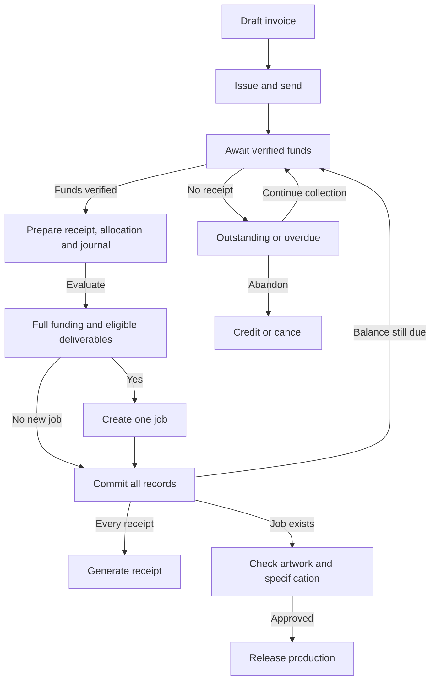

## Supplier estimates, bills and payments

Estimates are planning data. Supplier bills and incurred-cost accruals establish actual cost/asset and obligations under the approved policy. Payments settle or create advances.

<!-- mermaid:id=supplier_cost_flow -->
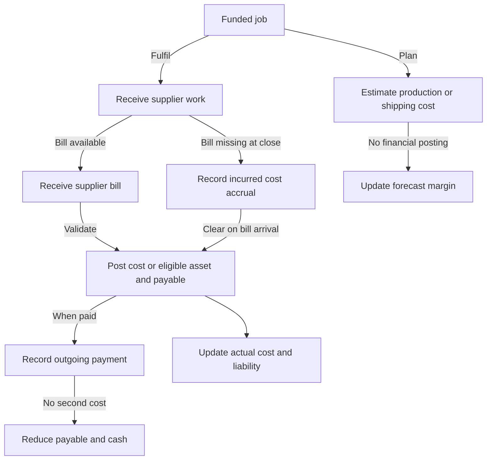

## Application and infrastructure

Domain modules share one application and database. Outbox tasks are database rows, not a separate messaging service. External integrations are optional after the manual pilot.

<!-- mermaid:id=application_architecture -->
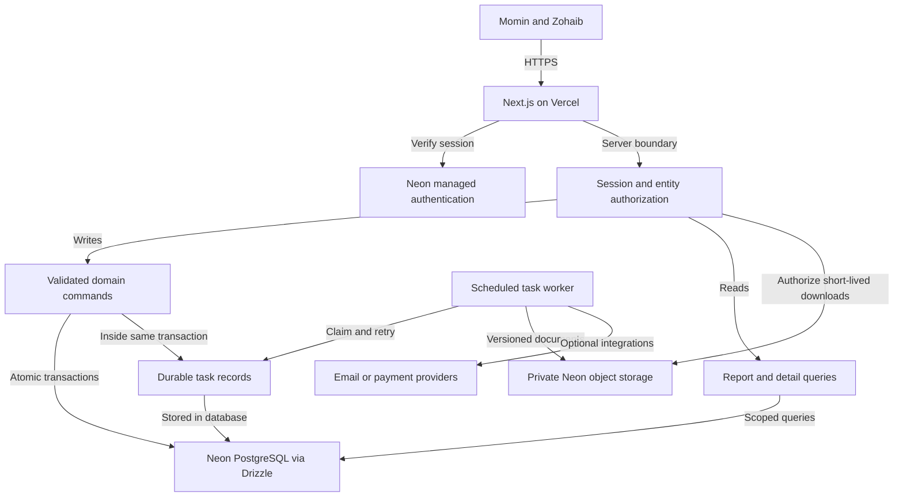

## Atomic payment posting and document generation

Failure before commit rolls back the transaction. A request retry returns the existing result. A file-generation failure retries independently and cannot duplicate the receipt posting.

<!-- mermaid:id=record_payment_sequence -->
```mermaid
sequenceDiagram
  actor Operator as Operator
  participant App as Next.js command
  participant DB as PostgreSQL
  participant Worker as Task worker
  participant Files as Private storage
  Operator->>App: Record verified receipt with idempotency key
  App->>App: Validate session, permissions and input
  App->>DB: Begin transaction and claim request key
  App->>DB: Lock invoice and affected funding records
  DB-->>App: Current charges, credits and allocations
  App->>DB: Insert payment, allocation and balanced journal
  App->>DB: Create eligible job once&#59; enqueue receipt&#59; audit
  App->>DB: Commit all business records
  DB-->>App: Committed identifiers
  App-->>Operator: Payment and job result
  Worker->>DB: Claim committed PDF task with lease
  DB-->>Worker: Immutable document snapshot
  Worker->>Files: Write document to a new object key
  Files-->>Worker: Object key and checksum
  Worker->>DB: Store file metadata and finish task
%% portable-canonical-v2:eyJhY2Nlc3NpYmlsaXR5IjpudWxsLCJkYXRhIjp7Im1lc3NhZ2VzIjpbeyJmcm9tIjoiT3BlcmF0b3IiLCJraW5kIjoic3luYyIsInRleHQiOiJSZWNvcmQgdmVyaWZpZWQgcmVjZWlwdCB3aXRoIGlkZW1wb3RlbmN5IGtleSIsInRvIjoiQXBwIn0seyJmcm9tIjoiQXBwIiwia2luZCI6InN5bmMiLCJ0ZXh0IjoiVmFsaWRhdGUgc2Vzc2lvbiwgcGVybWlzc2lvbnMgYW5kIGlucHV0IiwidG8iOiJBcHAifSx7ImZyb20iOiJBcHAiLCJraW5kIjoic3luYyIsInRleHQiOiJCZWdpbiB0cmFuc2FjdGlvbiBhbmQgY2xhaW0gcmVxdWVzdCBrZXkiLCJ0byI6IkRCIn0seyJmcm9tIjoiQXBwIiwia2luZCI6InN5bmMiLCJ0ZXh0IjoiTG9jayBpbnZvaWNlIGFuZCBhZmZlY3RlZCBmdW5kaW5nIHJlY29yZHMiLCJ0byI6IkRCIn0seyJmcm9tIjoiREIiLCJraW5kIjoicmVwbHkiLCJ0ZXh0IjoiQ3VycmVudCBjaGFyZ2VzLCBjcmVkaXRzIGFuZCBhbGxvY2F0aW9ucyIsInRvIjoiQXBwIn0seyJmcm9tIjoiQXBwIiwia2luZCI6InN5bmMiLCJ0ZXh0IjoiSW5zZXJ0IHBheW1lbnQsIGFsbG9jYXRpb24gYW5kIGJhbGFuY2VkIGpvdXJuYWwiLCJ0byI6IkRCIn0seyJmcm9tIjoiQXBwIiwia2luZCI6InN5bmMiLCJ0ZXh0IjoiQ3JlYXRlIGVsaWdpYmxlIGpvYiBvbmNlOyBlbnF1ZXVlIHJlY2VpcHQ7IGF1ZGl0IiwidG8iOiJEQiJ9LHsiZnJvbSI6IkFwcCIsImtpbmQiOiJzeW5jIiwidGV4dCI6IkNvbW1pdCBhbGwgYnVzaW5lc3MgcmVjb3JkcyIsInRvIjoiREIifSx7ImZyb20iOiJEQiIsImtpbmQiOiJyZXBseSIsInRleHQiOiJDb21taXR0ZWQgaWRlbnRpZmllcnMiLCJ0byI6IkFwcCJ9LHsiZnJvbSI6IkFwcCIsImtpbmQiOiJyZXBseSIsInRleHQiOiJQYXltZW50IGFuZCBqb2IgcmVzdWx0IiwidG8iOiJPcGVyYXRvciJ9LHsiZnJvbSI6IldvcmtlciIsImtpbmQiOiJzeW5jIiwidGV4dCI6IkNsYWltIGNvbW1pdHRlZCBQREYgdGFzayB3aXRoIGxlYXNlIiwidG8iOiJEQiJ9LHsiZnJvbSI6IkRCIiwia2luZCI6InJlcGx5IiwidGV4dCI6IkltbXV0YWJsZSBkb2N1bWVudCBzbmFwc2hvdCIsInRvIjoiV29ya2VyIn0seyJmcm9tIjoiV29ya2VyIiwia2luZCI6InN5bmMiLCJ0ZXh0IjoiV3JpdGUgZG9jdW1lbnQgdG8gYSBuZXcgb2JqZWN0IGtleSIsInRvIjoiRmlsZXMifSx7ImZyb20iOiJGaWxlcyIsImtpbmQiOiJyZXBseSIsInRleHQiOiJPYmplY3Qga2V5IGFuZCBjaGVja3N1bSIsInRvIjoiV29ya2VyIn0seyJmcm9tIjoiV29ya2VyIiwia2luZCI6InN5bmMiLCJ0ZXh0IjoiU3RvcmUgZmlsZSBtZXRhZGF0YSBhbmQgZmluaXNoIHRhc2siLCJ0byI6IkRCIn1dLCJwYXJ0aWNpcGFudHMiOlt7ImFjdG9yIjp0cnVlLCJpZCI6Ik9wZXJhdG9yIiwibGFiZWwiOiJPcGVyYXRvciJ9LHsiYWN0b3IiOmZhbHNlLCJpZCI6IkFwcCIsImxhYmVsIjoiTmV4dC5qcyBjb21tYW5kIn0seyJhY3RvciI6ZmFsc2UsImlkIjoiREIiLCJsYWJlbCI6IlBvc3RncmVTUUwifSx7ImFjdG9yIjpmYWxzZSwiaWQiOiJXb3JrZXIiLCJsYWJlbCI6IlRhc2sgd29ya2VyIn0seyJhY3RvciI6ZmFsc2UsImlkIjoiRmlsZXMiLCJsYWJlbCI6IlByaXZhdGUgc3RvcmFnZSJ9XX0sImRlc2NyaXB0aW9uIjoiRmFpbHVyZSBiZWZvcmUgY29tbWl0IHJvbGxzIGJhY2sgdGhlIHRyYW5zYWN0aW9uLiBBIHJlcXVlc3QgcmV0cnkgcmV0dXJucyB0aGUgZXhpc3RpbmcgcmVzdWx0LiBBIGZpbGUtZ2VuZXJhdGlvbiBmYWlsdXJlIHJldHJpZXMgaW5kZXBlbmRlbnRseSBhbmQgY2Fubm90IGR1cGxpY2F0ZSB0aGUgcmVjZWlwdCBwb3N0aW5nLiIsImlkIjoicmVjb3JkX3BheW1lbnRfc2VxdWVuY2UiLCJraW5kIjoic2VxdWVuY2UiLCJzb3VyY2VTaGEyNTYiOiI3NDI3YzY2MzgzY2I1ZTVmNWM1YTVkN2Y0OTRiNmUxNDQ1NWExZTVhNDEyMmMwZTM3YThmNTkwZmZlN2M5ZDg0Iiwic3R5bGVzIjpbXSwidGl0bGUiOiJBdG9taWMgcGF5bWVudCBwb3N0aW5nIGFuZCBkb2N1bWVudCBnZW5lcmF0aW9uIiwidmVyc2lvbiI6MX0
```

## Customer invoices, allocations and jobs

Allocation tables enable several payments per invoice and one payment across invoices. A unique originating invoice permits at most one job. Customer/entity/currency constraints are described in the schema document.

<!-- mermaid:id=customer_money_er -->
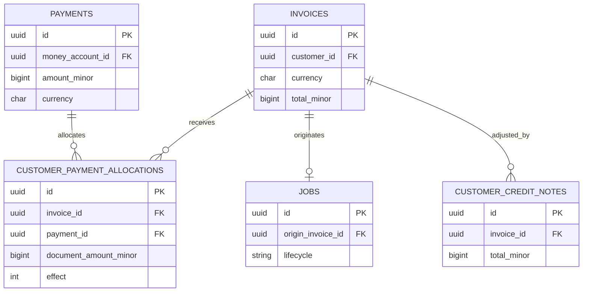

## Jobs and quantity-based shipping

Shipment items track partial deliveries. A single tracking number cannot represent the whole job once consignments split. Production item quantities are shown in the next diagram.

<!-- mermaid:id=fulfilment_er -->
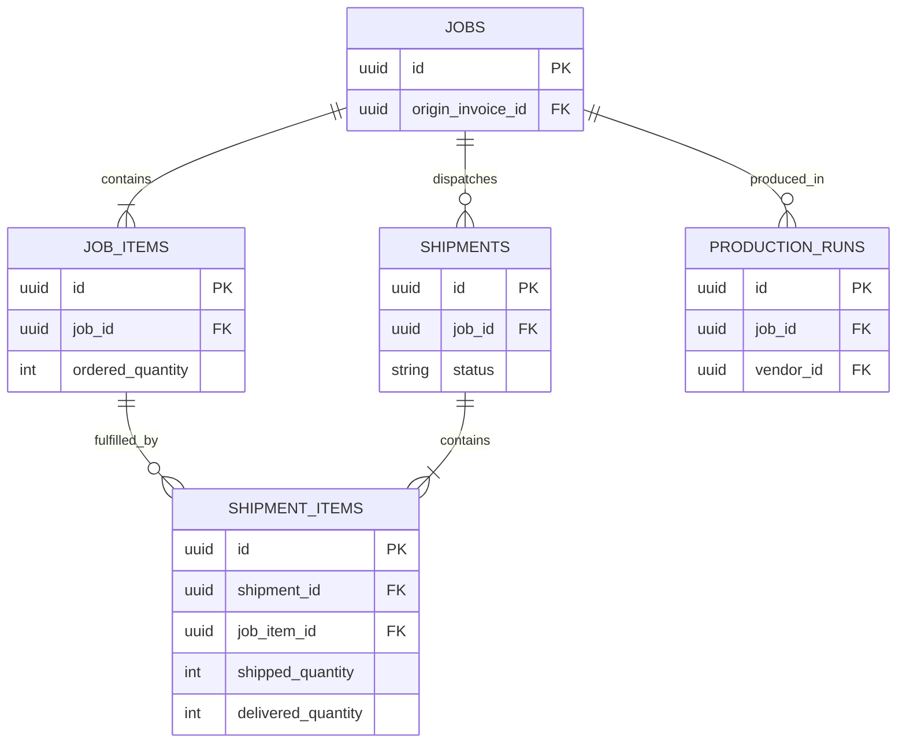

## Production runs and item quantities

Every run item must belong to the same job as its run. V1 assigns a run to one job; a supplier may work on many runs.

<!-- mermaid:id=production_er -->
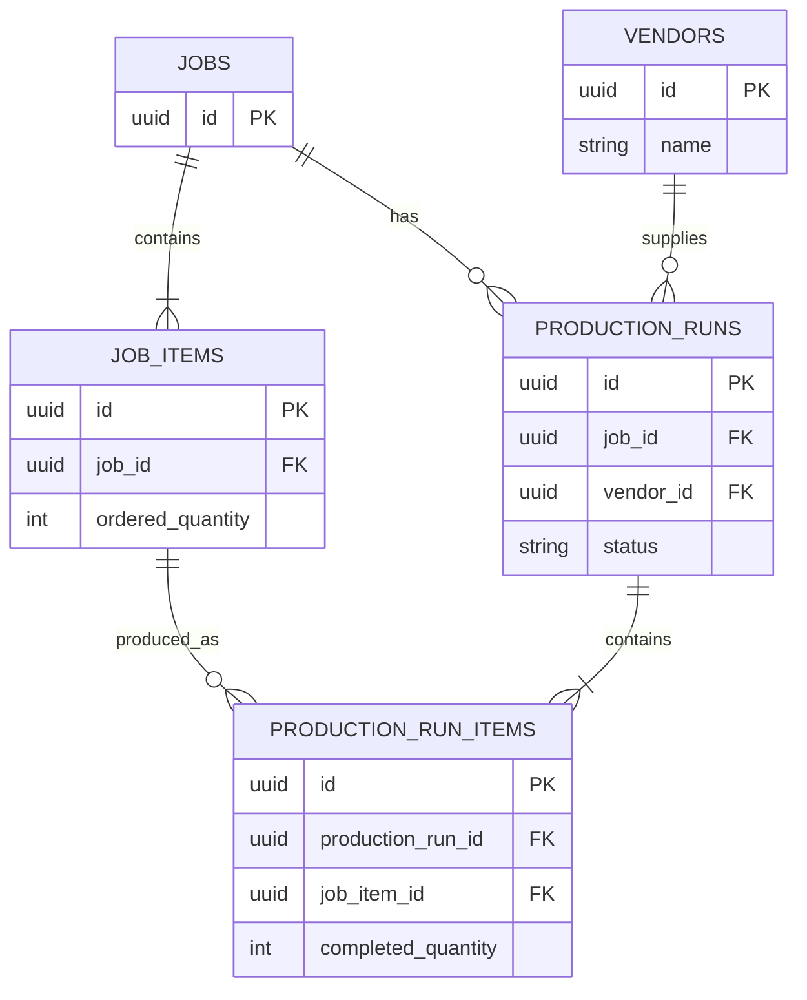

## Supplier bills, job cost and settlement

Bill lines can be linked to a job or classified as overhead. One bill may cover several jobs using separate lines. A bill can exist unpaid, and an unallocated payment can be a vendor advance.

<!-- mermaid:id=vendor_money_er -->
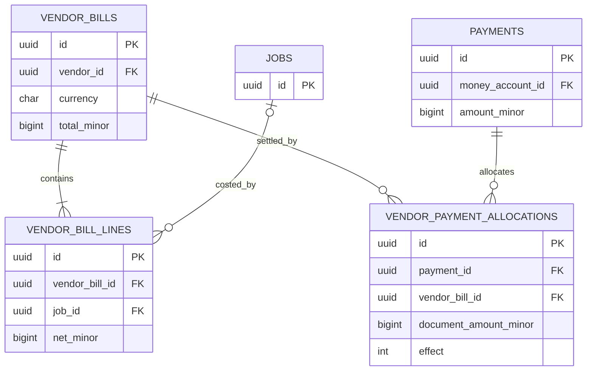

## One ledger supporting all financial views

Posted entries balance in the entity functional currency. Customer/vendor/job/partner dimensions are on journal lines but omitted here for readability. Money-account balances are derived from cash ledger lines.

<!-- mermaid:id=ledger_er -->
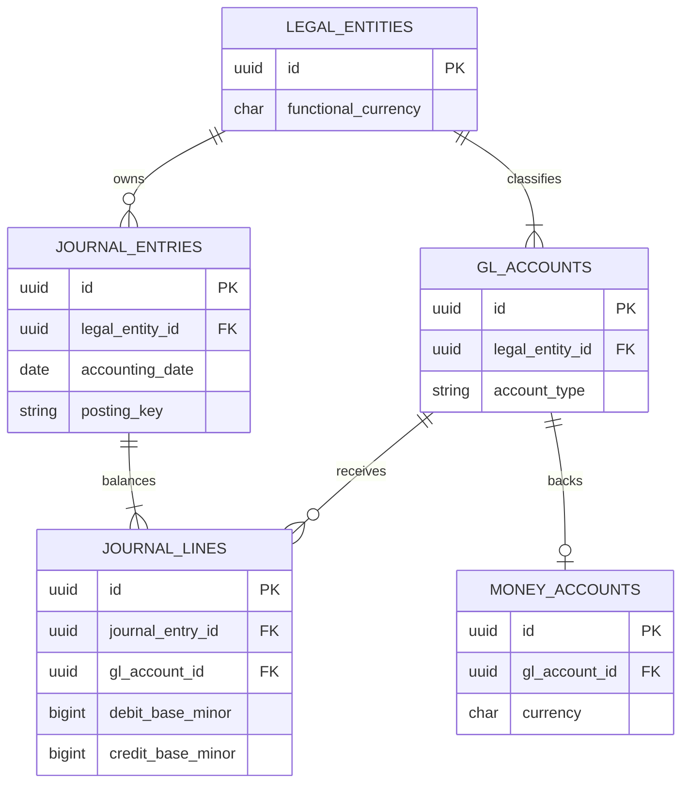

## Partner positions and movements

Partner events may be non-cash, such as a profit allocation. A cash event and its payment reference the same journal rather than posting twice. Capital, loans and current balances stay separate.

<!-- mermaid:id=partner_er -->
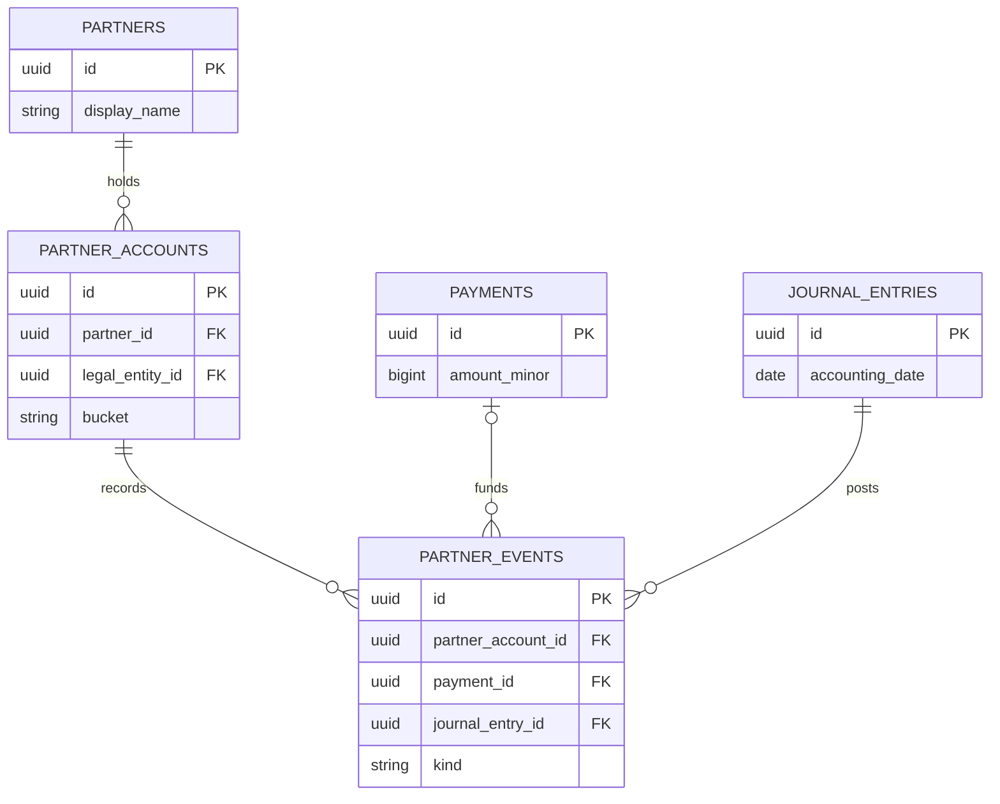

## Cash movement and profit are different views

Conceptual financial effects; the enforceable-invoice branch can establish the advance liability before receipt. Supplier payment settles an obligation; it does not duplicate previously recognised cost.

<!-- mermaid:id=cash_and_profit -->
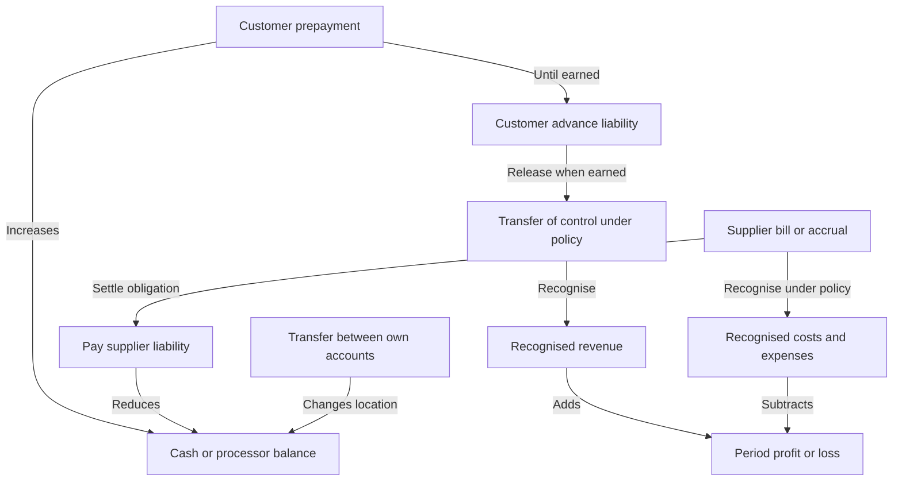

## Build dependencies and release gates

This is a dependency map, not a calendar estimate. The pilot launches before the app can claim complete business P&L coverage.

<!-- mermaid:id=build_dependencies -->
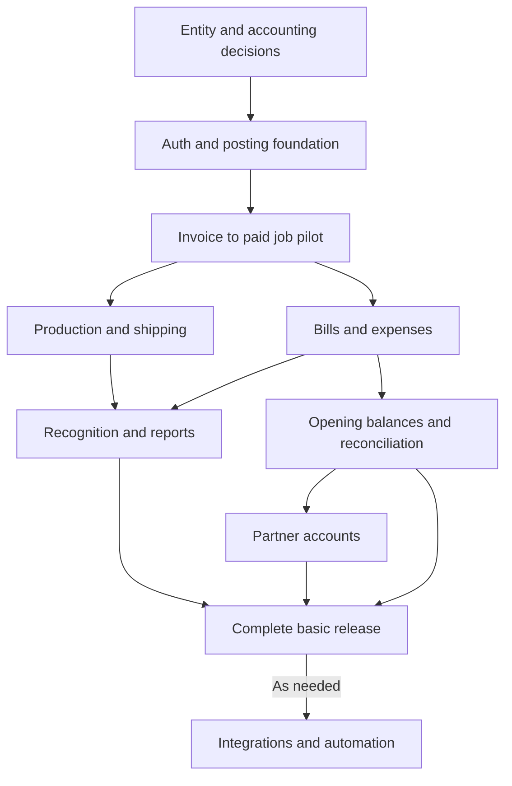
